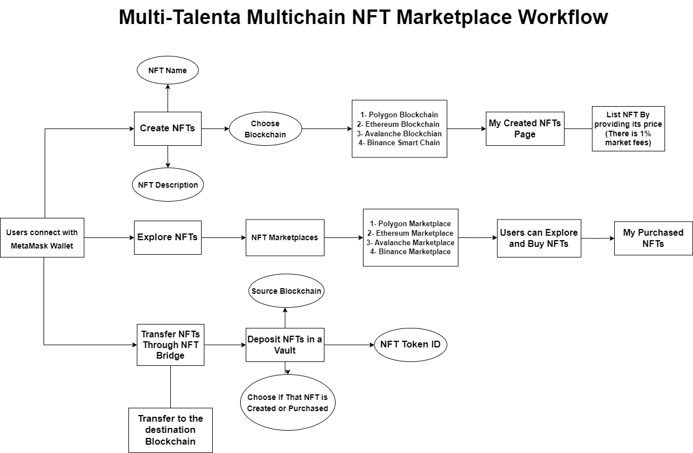

# Multi-Talenta-A-Multichain-NFTmarketplace-With-NFT-Bridge

## Introduction
Non-Fungible Tokens (NFTs) are cryptographic assets that based on blockchain technology. They cannot be exchanged or traded equivalently like other cryptographic assets cryptocurrencies such as: Bitcoin or Ethereum. NFTs can be traded (buy or sell) with other NFTs or via the NFT marketplace, which is a decentralized platform. Since 2017, the rise in cryptocurrency influenced the rise in the NFT market. In 2020, the NFT market was estimated $100 million. By late 2022 this value increased by approximately 110x to $11.3 billion. There are two types of NFT marketplace: signle-chain markerplace which are deployed on only one blockchain for example on polygon, so that users should have MATIC to pay market fees or even to list and buy NFTs. In contrast, there are multichain NFT marketplaces which a marketplace can be deployed on more than one blockchain. Hence, user can find NFTs deployed on Ethereum or polygon or even Binance smart chain (all of these in one marketplace). In addition, users also can transfer data between different blockchains.
## Is there an ideal NFT marketplace in the market now ?
The ideal NFT marketplace should have special criteria. There are many NFT marketplaces to choose from, but which features you have to actually look for?
Some of these features (criteria):
- Speed of transaction: Marketplace should be deployed on a blockchain that characterized by its seamless transaction speed.
- Transaction cost: The fees should be very low.
- Security: Marketplace should be secure enough so users can deposity their money.
Based on the above criteria or features, let’s take a look on the most famous blockchain for marketplace development which are for example: Polygon, Ethereum, and Binance. Which blockchain you will choose for your NFT Marketplace deployment ?

## Problem Statement

## Problem Solution
### Why you have to pick between one or the other blockchain for your NFT marketplace developement and deployment when you can have it all ?
So the solution is simply: create A multichain NFT Marketplace that users can create and mint or trade (buy and sell) NFTs on their desired blockchain. Moreover, users can also transfer their NFTs across different blockchains easily using NFT Bridge.

## Project Description
## Will the multichain NFT marketplace dominate in the future ?
- NFTs marketplaces are going to be multichained. That means traders will enjoy less gas fees and faster transactions. However, this will become possible only when traders have multichain NFT marketplaces to trade their NFTs. Hence, we have to focus on implementing multichain marketplaces in the future.
- By this feature (Multichain), The marketplaces should be cross-chained also to enhance the interconnection between blockchain networks (chains) by allowing the exchange of information and value. Consequently, users will easily transfer their NFTs between different blockchains.

## Motivational video 
## Project Stack
- Solidity: For writing smart contracts (For the backend).
- ReactJS and JavaScript: For the front end.
- Ethers.js: To connect the backend (solidit) with the frontend (HTML and ReactJS). In addition, for handling the MetaMask connection, accounts, and chainId. It used also for handling any swtich in the chainId (blockchain).
- ChakraUI:for Styling the HTML. It same as CSS but it is very simple and easier than seprating the HTML into two pages (.js and .css).
## Technologies used
- Polygon: Deploy the Marketplace, NFT Creation, and bridge on it.
- Chainlink: Using Price feeds to get the real-world market prices of different cryptocurrencies (MATIC, ETH, BNB, and AVAX) with the USD pair to convert the NFT listing price to USD price. So that, users can see the NFT in both of the blockchain's coin and USD.
- NFT.Storage: For storing NFTs Metadata such as NFT name, description, and NFT asset (image) link.
- IPFS: NFT.Storage is a simple and free service that makes it easy to upload NFT metadata on IPFS (decentralized storage). The uploaded data is content addressed using IPFS; once users upload their data, a content identifier "CID" is generated that uniquely pointing to that data only which can be used on the IPFS domain.
- alchemy: To connect with RPC endpoint to communicatin with blockchain nodes such as: Goerli Ethereum Test network.
- Hardhat: For compiling,deploying, and verifying solidity smart contracts.
## Project Features
### Multichain Marketplace
- Users can create and mint NFTs on 4 different blockchains (Polygon, Ethereum, Avalanche, and Binance Smart Chain).
- Each NFT on Each blockchain will has its own characteristics.
- It would allow seamless connectivity between NFTs minted on different chains (networks).
### Storage
- All NFTs assets metadata stored on decentralized storage like IPFS which is NFT.Storage
- NFT.Storage is a free and secure service by Protocol Labs that allows users to store and protect their NFT assets and their metadata through content addressing and decentralized storage to ensure that all NFTs follow best practices to stay accessible long-term.
### Integration with Chainlink 
- Multi-Talenta used chainlink price feeds to get real-world market prices of cryptocurrencies with the USD pair. Hence, Assets prices will be in blockchain coin and dollars. This will be good for users to see how much they will buy a specific NFT in dollar $.
### NFT Bridge 
- As the multi-Talenta supports 4 different blockchains, users can use the NFT bridge to connect two different networks and transfers NFTs between them.
- The NFT bridge works very fast.

## How Multi-Talenta works ?
There are 4 main functionalities of Multi-Talenta which are: creating NFTs, Exploring (Listing and buying NFTs on the Marketplace), connecting to the real world market prices of cryptocurriences like: MATIC/USD, ETH/USD, AVAX/USD, and BNB/USD using chainlink price feeds, and transferring NFTs across the 4 blockchains using NFT Bridge.
### NFTs Creation Mechanism:
- Firstly, users will connect to the Multi-Talenta through MetaMask wallet.
- They will enter NFT name, NFT description, and What blockchain they desire to create and mint the NFt on.
- Based on the chosen blockchain, multi-talenta will ask users to switch the network (chainid) to the target chainin (chosen blockchain).
- Then upload the NFT image and click on Create NFT.
### Explore (Trade: Buy and Sell) NFTs on the marketplace Mechanism:
- When users create their NFTs, the created NFTs will be shown in the /mycreatednfts endpoint (My Created NFTs page). 
- In the My Created NFTs page, users can click on List to list (sell) their NFT on the marketplace. They have to provide the NFT's price.
- Note: there is a 1% market fees on the listing price. If user X sell his NFT with 100 MATIC, the price will be 101 MATIC. Hence, when user Y wants to buy user X NFT, he will pay 101 MATIC, 100 will be transferred to the user X (seller) and 1 MATIC (the 1% market fees) will be transferred to withdrawfeesaccount that the contract owner (deployer) define on deploying the NFT Marketplace contract (in the constructor).
- Then the NFT will be removed from the My Created page because now I am checking on islisted parameter which is now equals to true.
- Other users can see the listed NFTs by clicking on NFTs Marketplaces (/nftmarketplaces endpoint) and choose what marketplace they want. If a user connects with Mumbai polygon network and choose Ethereum Marketplace, he has to switch his network to Ethereum Goreli to view the listed NFT items on the Ethereum marketplace.
- When user buy an NFT, it will be shown in My Purchased NFTs page (/mypurchasednfts endpoint). 
- From this page, users also can sell their NFTs again and make profits.
### Transfer NFTs using NFT Bridge:
- Firstly, users choose the source blockchain and NFT tokenid. In addition, they have to provide if that NFT is created (fresh NFT not listed before or purchased) or purchased NFT (that user bought it from the marketplace). If users provide a tokenid that do not own it, there will be an error appears.
- Then Deposit that NFT to the Vault. The vault is like a dead wallet address that the NFT marketplace owner (deployer) defines in the constructor. Once the user deposit the NFT to the vault, he have to choose the destination blockchain.
- In the destination blockchain, there is a function to create new NFT with the same characterstics of the deposited NFT.
- The transfered NFT will be appear on the My Created NFTs page of the destination blockchain (network).
## Multi-Talenta's Mechanism workflow (diagram)
I summerized the main functionalities of Multi-Talenta marketplace and how it works in a diagram. 

## Live Website
### Here is the [Multi-Talent live website](https://google.com).
## Demo Video
### I uploaded the demo video on google drive. Here is the link ([Demo Video](https://google.com)), please take a look on it.
## Future plans
### More Blockchains
- Currently, Multi-Talenta supports 4 blockchains. In the future, I will work on the integration with more blockchains; therefore, more users will use it.
### Earning Rewards
- Implement a simple ERC-20 token and reward users who deposit their NFTs and hold them in a Vault for a period of time.
- Something like NFT staking.
### Pay with market (Multi-Talenta) coin
- Give the user the option of list and buy the NFTs with the chosen blockchain coin (MATIC, ETH, AVAX, and BNB) or the marketplace's coin.
## Conclusion
Finally, 
